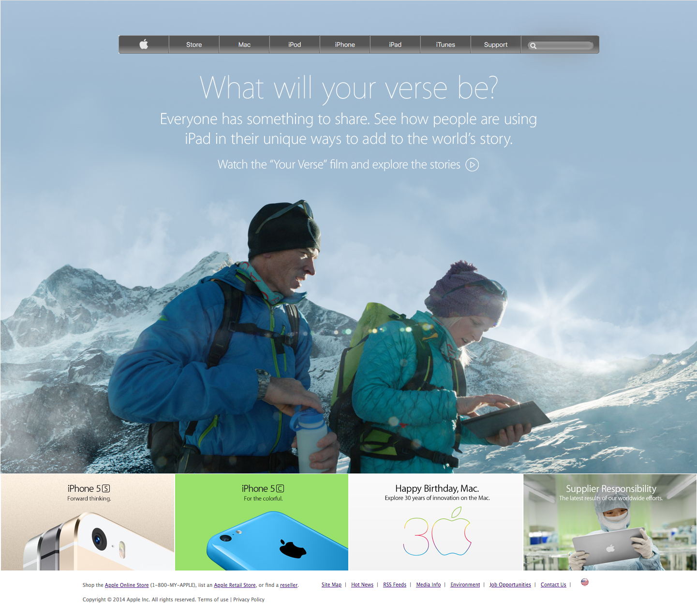

# Apple Home Page

> Recreating the classic Apple home page ...

Aim of the project is for continous practice of HTML5 and CSS3. The particular focus was on background images and linear gradients.

## Built With

- HTML5
- CSS3

## Live Demo

[Live Demo Link](https://livedemo.com)

## To Install and Run ...

- Download all the files to a folder
- Open index.html in a web browser

## Authors

👤 Paul Omondi

- Github: [@githubhandle](https://github.com/paulo-techie)
- Linkedin: [linkedin](https://www.linkedin.com/in/paul-o-43051a31)

## 🤝 Contributing

Contributions, issues and feature requests are welcome!

Feel free to check the [issues page](issues/).

## Show your support

Give a ⭐️ if you like this project!

## Acknowledgments

- Thanks to Microverse for the learning opportunity ane experience. 

## 📝 License

This project is [MIT](lic.url) licensed.
